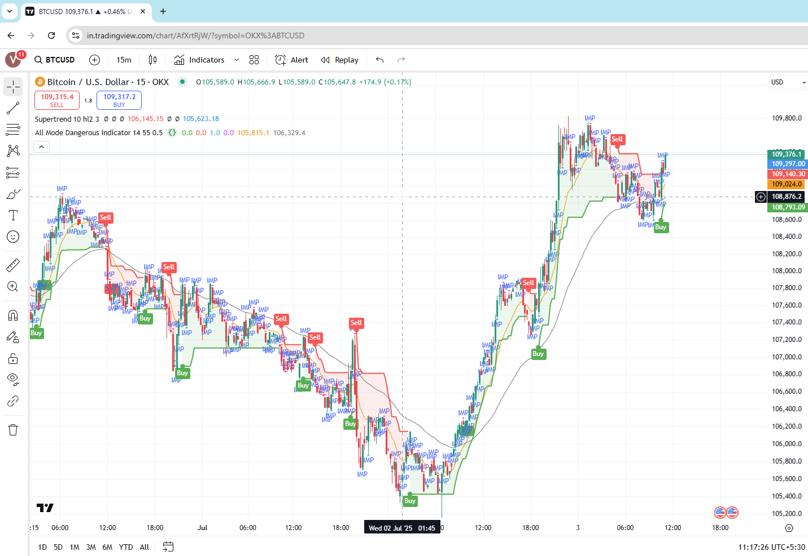

# TradingView to MT5 Auto Trading Bot

This Python script connects **TradingView webhook alerts** with **MetaTrader 5 (MT5)** to automate trading for symbols like `BTCUSD` and `XAUUSD`.  
It listens for signals (buy/sell) from TradingView and places or closes trades in MT5 accordingly.

---

## Features
- Automatically places **BUY** or **SELL** orders on MT5 when signals are received from TradingView.
- Closes opposite trades when a new signal is triggered.
- Supports **impulsive trades** (`ibuy`/`isell`) with counters to prevent over-trading.
- Flask-based webhook server for **real-time TradingView integration**.
- Configurable slippage (`DEVIATION`) and magic numbers.
- Separate handling for **BTCUSD** and **XAUUSD**.
- Can be extended to monitor loss thresholds or periodic trade checks.

---

## Requirements

### Software
- Python 3.8+
- MetaTrader 5 (Exness or any MT5 broker)
- TradingView account (with alert webhooks enabled)

### Python Libraries
```bash
pip install MetaTrader5 flask
```

---

## Setup

### 1. Configure MT5 Account
Update these fields in the script:
```python
MT5_ACCOUNT = 12345678         # Your MT5 account number (integer)
MT5_PASSWORD = "your_password" # Your MT5 account password
MT5_SERVER = "Exness-MT5Real"  # Your broker's MT5 server name
```

---

### 2. Run the Flask Server
Run the Python script:
```bash
python trading_bot.py
```
The server will start on:
```
http://localhost:5000/webhook
```

---

### 3. Expose the Local Server
Use **ngrok** to expose your local Flask server:
```bash
ngrok http 5000
```
Copy the public URL provided by ngrok, e.g.:
```
https://abcd1234.ngrok.io/webhook
```

---

### 4. Configure TradingView
1. Open your **TradingView chart** with the UT Bot Alerts indicator.
2. Create a new alert (`Buy` or `Sell`).
3. In the alert message, send a JSON payload:
   ```json
   { "signal": "buy", "volume": 0.01, "symbol": "BTCUSD" }
   ```
4. Set the webhook URL to:
   ```
   https://abcd1234.ngrok.io/webhook
   ```

---

## Webhook Payload Examples
### Place a BUY order
```json
{ "signal": "buy", "volume": 0.01, "symbol": "BTCUSD" }
```

### Place a SELL order
```json
{ "signal": "sell", "volume": 0.01, "symbol": "XAUUSD" }
```

### Close all positions for a symbol
```json
{ "action": "close", "symbol": "BTCUSD" }
```

---

## Logs
The script prints all trade actions to the console:
```
Connected to MT5!
Webhook Received: {'signal': 'buy', 'volume': 0.01, 'symbol': 'BTCUSD'}
Trade executed: BUY at 95000.0 with volume 0.01
```

---

## Important Notes
- Always test on a **demo account first**.
- Ensure the symbol (e.g., `BTCUSD`) matches the name in MT5 exactly.
- Some brokers might not support **IOC filling mode** (`ORDER_FILLING_IOC`).  
  If you get error `10030 (Unsupported filling mode)`, change:
  ```python
  "type_filling": mt5.ORDER_FILLING_IOC
  ```
  to:
  ```python
  "type_filling": mt5.ORDER_FILLING_FOK
  ```

---

## Future Enhancements
- Periodic monitoring for trade losses (e.g., auto-close if loss > $150).
- Trailing stop-loss.
- Telegram notifications.
- Multi-symbol trading from a single webhook.

## Trading Viewsetup 
 - 

## Author
**Vishnu AR** 

---
